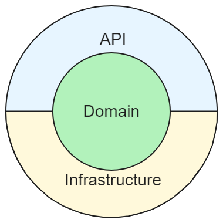

<a name="readme-top"></a>

[![MIT License][license-shield]][license-url]
[![LinkedIn][linkedin-shield]][linkedin-url]


<!-- PROJECT LOGO -->
<br />
<div align="center">
  

 

---
  <h3 align="center">Bapi</h3>

  <p align="center">
    Simple Api test Project
    <br />
    <br />
    <a href="https://github.com/joao-paulo-santos/PyFolderSync/issues">Report Bug</a>
    ·
    <a href="https://github.com/joao-paulo-santos/PyFolderSync/issues">Request Feature</a>
  </p>
</div>


<!-- ABOUT THE PROJECT -->
## About The Project

This is a small assignment that was requested as a proof of skill.<br>
The project consists of an small API representing a library, the users should be able to search for books and managers should be able to edit or remove books.

Requirements:
- Use .Net 6 or 8
- User authentication
- Logging
- Query/Filter
- Create Read Update Delete books

---

<p align="right">(<a href="#readme-top">back to top</a>)</p>


### Built With

 [![.Net][.Net-Shield]][.Net-url]
[![postgresql][postgresql-Shield]][postgresql-url]
<p align="right">(<a href="#readme-top">back to top</a>)</p>


<!-- GETTING STARTED -->
## Getting Started

### Prerequisites

- Visual Studio installed

### Installation

 - Clone the repo
```sh
git clone https://github.com/joao-paulo-santos/bapi.git
```


<p align="right">(<a href="#readme-top">back to top</a>)</p>


<!-- USAGE EXAMPLES -->
## Usage

 - Starting the program: 
```sh
Visual Studio /// Docker Container Deploy
```

[WIP]

<p align="right">(<a href="#readme-top">back to top</a>)</p>


## Technical Documentation

### Architecture

I chose a simplified version of the onion architecture for this .NET project because it promotes loose coupling and separation of concerns. The core domain layer remains independent of external frameworks and databases (infrastructure layer). This brings several benefits:

- Testability: The core business logic (domain layer) is easily unit tested in isolation.
- Maintainability: Changes to UI or data access won't affect the core logic, simplifying maintenance.
- Reusability: The core domain can be potentially reused across different applications or UIs."
<div align="center">

</div>

### Database

The database chosen was PostgreSQL hosted on [Neon](https://neon.tech/) for its ease of setup and potential scalability. Normally for such a small project I would choose SQLite or even a JSON document along with a minimal .Net API, but I feel that would defeat the purpose of a proof of skill.

#### DB Structure


<br>

```sql
CREATE TYPE role AS ENUM ('Admin', 'Manager', 'User');

CREATE TABLE member (
  id SERIAL PRIMARY KEY,
  user_role role NOT NULL,
  username VARCHAR (20) UNIQUE NOT NULL, 
  password CHAR (32) NOT NULL
);

CREATE TABLE book (
  id SERIAL PRIMARY KEY,
  name VARCHAR (120) UNIQUE NOT NULL, 
  description Text NOT NULL
);

```

#### Initial Data

```sql
-- Password is md5('Aa1234')
INSERT INTO user(user_role, username, password )
VALUES('Admin','admin','e267cfcd18461ce938067eca67c59f41');
```

### Packages Used
```sh
# Swagger
dotnet add package Swashbuckle.AspNetCore 

#Entity Framework + Postgre Addon
dotnet add package Microsoft.EntityFrameworkCore
dotnet add package Npgsql.EntityFrameworkCore.PostgreSQL
dotnet add package Npgsql.EntityFrameworkCore.PostgreSQL.Design
```


<!-- LICENSE -->
## License

Distributed under the Apache-2 License. See `LICENSE` for more information.

<p align="right">(<a href="#readme-top">back to top</a>)</p>


<!-- CONTACT -->
## Contact

João Santos - [Linkedin](https://www.linkedin.com/in/jo%C3%A3o-santos-015a082b9/)

Project Link: [https://github.com/joao-paulo-santos/bapi](https://github.com/joao-paulo-santos/bapi)

<p align="right">(<a href="#readme-top">back to top</a>)</p>


[license-shield]: https://img.shields.io/pypi/l/giteo?style=for-the-badge
[license-url]: https://github.com/joao-paulo-santos/PyFolderSync/blob/master/LICENSE
[linkedin-shield]: https://img.shields.io/badge/-LinkedIn-black.svg?style=for-the-badge&logo=linkedin&colorB=555
[linkedin-url]: https://www.linkedin.com/in/jo%C3%A3o-santos-015a082b9/
[.Net-shield]: https://img.shields.io/badge/.NET_8-5C2D91?style=for-the-badge&logo=.net&logoColor=white
[.Net-url]: https://learn.microsoft.com/en-us/dotnet/core/whats-new/dotnet-8/overview
[PostgreSQL-shield]: https://img.shields.io/badge/PostgreSQL-316192?style=for-the-badge&logo=postgresql&logoColor=white
[PostgreSQL-url]: https://www.postgresql.org/
