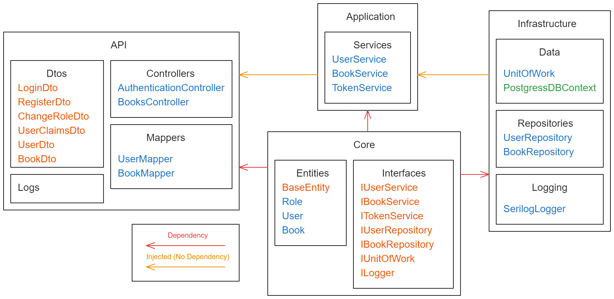
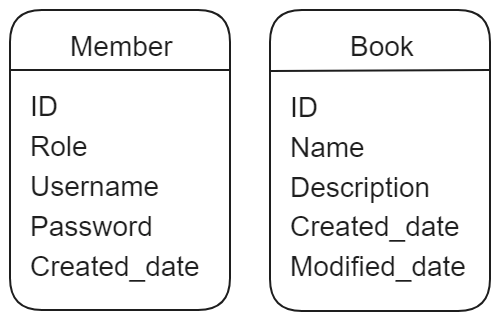

<a name="readme-top"></a>

[![MIT License][license-shield]][license-url]
[![LinkedIn][linkedin-shield]][linkedin-url]


<!-- PROJECT LOGO -->
<br />
<div align="center">
  

 

---
  <h3 align="center">Bapi</h3>

  <p align="center">
    Simple Api test Project
    <br />
    <br />
    <a href="https://github.com/joao-paulo-santos/PyFolderSync/issues">Report Bug</a>
    ·
    <a href="https://github.com/joao-paulo-santos/PyFolderSync/issues">Request Feature</a>
  </p>
</div>


<!-- ABOUT THE PROJECT -->
## About The Project

This is a small assignment that was requested as a proof of skill.<br>
The project consists of an small API representing a library, the users should be able to search for books and managers should be able to edit or remove books.

Requirements:
- Use .Net 6 or 8
- User authentication
- Logging
- Query/Filter
- Create Read Update Delete books

---

<p align="right">(<a href="#readme-top">back to top</a>)</p>


### Built With

 [![.Net][.Net-Shield]][.Net-url]
[![postgresql][postgresql-Shield]][postgresql-url]
<p align="right">(<a href="#readme-top">back to top</a>)</p>


<!-- GETTING STARTED -->
## Getting Started

### Prerequisites

- Visual Studio installed

### Installation

 - Clone the repo
```sh
git clone https://github.com/joao-paulo-santos/bapi.git
```


<p align="right">(<a href="#readme-top">back to top</a>)</p>


<!-- USAGE EXAMPLES -->
## Usage

 - Starting the program: 
```sh
Visual Studio /// Docker Container Deploy
```

[Work in Progres]

<p align="right">(<a href="#readme-top">back to top</a>)</p>


## Technical Documentation

### Architecture

I chose the clean architecture for this .NET project because it promotes loose coupling and separation of concerns. The core domain layer remains independent of external frameworks and databases (infrastructure layer). This brings several benefits:

- Testability: The core business logic (domain layer) is easily unit tested in isolation.
- Maintainability: Changes to UI or data access won't affect the core logic, simplifying maintenance.
- Reusability: The core domain can be potentially reused across different applications or UIs."
<div align="center">

</div>

#### Project Structure

<div align="center">

</div>

#### Logic Flow Example

<div align="center">

</div>

#### Implemented Software Design Patterns

1. **Repository Pattern**:
    - Encapsulates data access logic within repositories.
    - Repositories provide a layer of abstraction between the domain layer and the specific data storage technology (e.g., database, file system).
    - They define methods for CRUD (Create, Read, Update, Delete) operations on domain entities.
2. **Service Layer Pattern**:
    - Implements application logic and use cases in a dedicated service layer.
    - Services orchestrate domain logic, interact with repositories, and coordinate business rules.
    - They can also handle validation, authorization, and exception handling.
<div align="center">

</div>

**Figure** service and repository patterns illustration.

3. **Unit of Work Pattern**:
    - Manages a series of database operations as a unit, ensuring data consistency.
    - Tracks changes made to entities and provides methods to commit or rollback changes.
    - Provides an abstraction layer between services and repositories, promoting loose coupling.
<div align="center">

</div>

**Figure** Unit Of Work pattern Illustration


4. **Dependency Injection Pattern**:
    - Dependencies are injected into classes through constructors or methods.
    - Promotes loose coupling and easier testing by allowing mock or stub injections.

5. **Adapter Pattern**:
    - Adapts an existing interface to a different interface or framework.
    - Used within the infrastructure layer to integrate external libraries or services that don't conform to the application's internal interfaces. (Ilogger Implementation of Serilog.ILogger)

6. **Mapper Pattern**:
    - Maps data between different object representations.
    - Often used to map domain entities (complex objects representing domain concepts) to DTOs (simpler objects used for data transfer between layers).
    - Keeps domain logic clean and independent of data transfer concerns.

---

<p align="right">(<a href="#readme-top">back to top</a>)</p>

### Authentication

This .NET project leverages JSON Web Tokens (JWT) for user authentication. JWT offers several advantages that make it well-suited for this application:

**Stateless Authentication**: JWT tokens are self-contained, containing all the necessary information about the user (claims) within the token itself. This eliminates the need for server-side session management, simplifying the architecture and potentially improving scalability.

**Enhanced Security**: JWT tokens are cryptographically signed, ensuring their integrity and preventing unauthorized token modification. This strengthens security measures by protecting against potential attacks like session hijacking.

**Flexibility**: JWT tokens can be configured with various claims, allowing you to encode additional user information beyond just identity. This flexibility can be useful for implementing authorization logic based on user roles or permissions.

**Centralized Authentication**: With JWT, you can implement a separate authentication server responsible for issuing and validating tokens. This centralizes user authentication logic, preventing each microservice from needing its own user management system.

Overall, JWT authentication provides a robust and secure approach to user access management in this .NET project. Its stateless nature, strong security features, and flexibility make it a valuable tool for building modern and scalable web applications.

#### Role Permissions

| Role | Users (CRUD) | Books (CRUD) |
|---|---|---|
| Admin | Full | Full |
| Manager | Read (Own) | Full |
| User | Read (Own)| Read|
| Anonymous | Not Allowed| Read|

---

<p align="right">(<a href="#readme-top">back to top</a>)</p>

### Endpoints

<div align="center">


</div>

---

<p align="right">(<a href="#readme-top">back to top</a>)</p>

### Logging

I decided to use Serilog as the logging framework for this project because it offers several advantages over the default Microsoft.Extensions.Logging:

  - Flexibility: Serilog provides a rich configuration syntax and a wide range of sinks (destinations) for your logs. You can easily send logs to the console, file systems, databases, or external services.
  - Extensibility: Serilog has a large ecosystem of extensions and libraries that can enhance its capabilities, such as enriching logs with additional context or adding custom log levels.

#### Minimum Level Tweaks for Different Environments:

To balance development needs with production efficiency, I've configured Serilog to use different minimum logging levels for each environment:

  - Development: A lower minimum level (e.g., Debug or Information) will capture a wider range of informational messages, aiding in debugging and troubleshooting.
  - Production: A higher minimum level (e.g., Warning) will focus on capturing critical events and errors, reducing log verbosity and improving performance.

#### Interoperability with .net HttpLogging

While in the development environment HTTPLogging is configured along with Serilog to capture request/response headers and body for easier debugging, this is disabled for production for obvious privacy reasons.  

#### Fine-Tuning for Specific Needs:

These are just the initial configurations, and further adjustments can be made based on specific project requirements. For instance, you might want to:
  - Exclude certain log categories from being written to specific sinks.
  - Define custom log levels for capturing application-specific events.
  - Implement enrichment pipelines to add additional context (e.g., user ID, machine name) to log entries.

---

<p align="right">(<a href="#readme-top">back to top</a>)</p>

### Database

The database chosen was PostgreSQL hosted on [Neon](https://neon.tech/) for its ease of setup and potential scalability. Normally for such a small project I would choose SQLite or even a JSON document along with a minimal .Net API, but I feel that would defeat the purpose of a proof of skill.

#### DB Structure


<br>

```sql
--CREATE TYPE role AS ENUM ('Admin', 'Manager', 'User');

CREATE TABLE member (
  id SERIAL PRIMARY KEY,
  user_role int NOT NULL,
  username VARCHAR (20) UNIQUE NOT NULL, 
  password CHAR (32) NOT NULL,
  created_date TIMESTAMP  NOT NUll
);

CREATE TABLE book (
  id SERIAL PRIMARY KEY,
  name VARCHAR (120) NOT NULL, 
  description Text NOT NULL,
  created_date TIMESTAMP  NOT NUll,
  modified_date TIMESTAMP  NOT NUll
);

```

#### Initial Data

```sql
-- Password is md5('Aa1234')
INSERT INTO member(user_role, username, password, created_date) VALUES
(0,'admin','E267CFCD18461CE938067ECA67C59F41', NOW()),
(1,'manager','E267CFCD18461CE938067ECA67C59F41', NOW()),
(2,'user','E267CFCD18461CE938067ECA67C59F41', NOW()),
(1,'john','E267CFCD18461CE938067ECA67C59F41', NOW());

INSERT INTO book (name, description, created_date, modified_date)
VALUES
  ('The Lord of the Rings', 'An epic high-fantasy trilogy by J.R.R. Tolkien', NOW(), NOW()),
  ('Pride and Prejudice', 'A novel of manners by Jane Austen', NOW(), NOW()),
  ('To Kill a Mockingbird', 'A coming-of-age novel by Harper Lee', NOW(), NOW()),
  ('The Secret Garden', 'Experience a world of adventure a dystopian future', NOW(), NOW()),
  ('A Knights Quest', 'This is a captivating story about suspense a hidden truth', NOW(), NOW()),
  ('The Time Travelers Paradox', 'Embark on a thrilling journey through intrigue a forgotten kingdom', NOW(), NOW()),
  ('The Alchemist', 'Delve into the depths of suspense a hidden truth', NOW(), NOW());
```
<p align="right">(<a href="#readme-top">back to top</a>)</p>

### Packages Used
```sh
# Swagger
dotnet add package Swashbuckle.AspNetCore 

#Json Web Tokens
dotnet add package Microsoft.IdentityModel.JsonWebTokens 
dotnet add package Microsoft.AspNetCore.Authentication.JwtBearer

#Entity Framework + Postgre Addon
dotnet add package Microsoft.EntityFrameworkCore
dotnet add package Npgsql.EntityFrameworkCore.PostgreSQL
dotnet add package Npgsql.EntityFrameworkCore.PostgreSQL.Design

#Logging (Serilog)
$ dotnet add package Serilog
$ dotnet add package Serilog.AspNetCore
$ dotnet add package Serilog.Sinks.Console
$ dotnet add package Serilog.Sinks.File
```


<!-- LICENSE -->
## License

Distributed under the Apache-2 License. See `LICENSE` for more information.

<p align="right">(<a href="#readme-top">back to top</a>)</p>


<!-- CONTACT -->
## Contact

João Santos - [Linkedin](https://www.linkedin.com/in/jo%C3%A3o-santos-015a082b9/)

Project Link: [https://github.com/joao-paulo-santos/bapi](https://github.com/joao-paulo-santos/bapi)

<p align="right">(<a href="#readme-top">back to top</a>)</p>


[license-shield]: https://img.shields.io/pypi/l/giteo?style=for-the-badge
[license-url]: https://github.com/joao-paulo-santos/PyFolderSync/blob/master/LICENSE
[linkedin-shield]: https://img.shields.io/badge/-LinkedIn-black.svg?style=for-the-badge&logo=linkedin&colorB=555
[linkedin-url]: https://www.linkedin.com/in/jo%C3%A3o-santos-015a082b9/
[.Net-shield]: https://img.shields.io/badge/.NET_8-5C2D91?style=for-the-badge&logo=.net&logoColor=white
[.Net-url]: https://learn.microsoft.com/en-us/dotnet/core/whats-new/dotnet-8/overview
[PostgreSQL-shield]: https://img.shields.io/badge/PostgreSQL-316192?style=for-the-badge&logo=postgresql&logoColor=white
[PostgreSQL-url]: https://www.postgresql.org/
